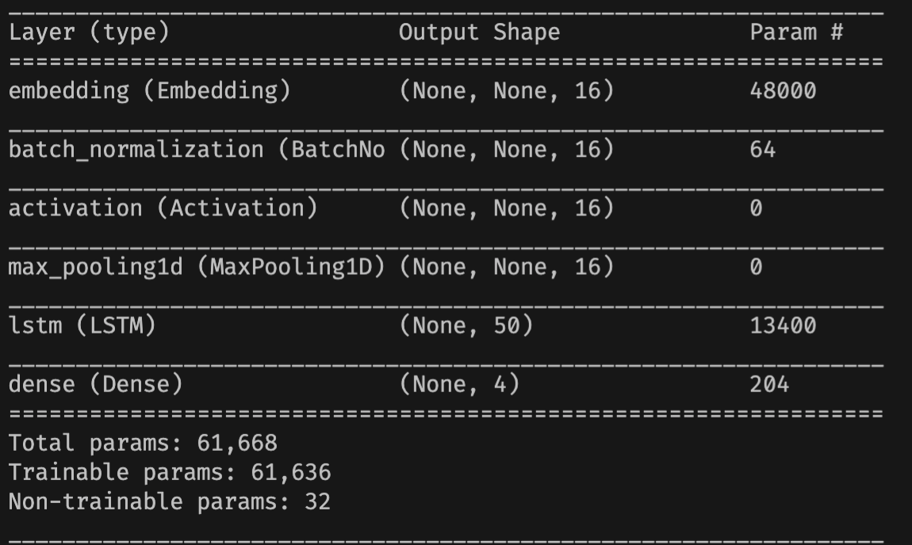
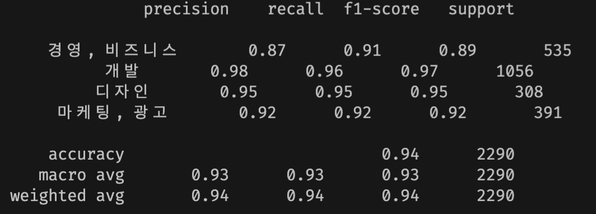
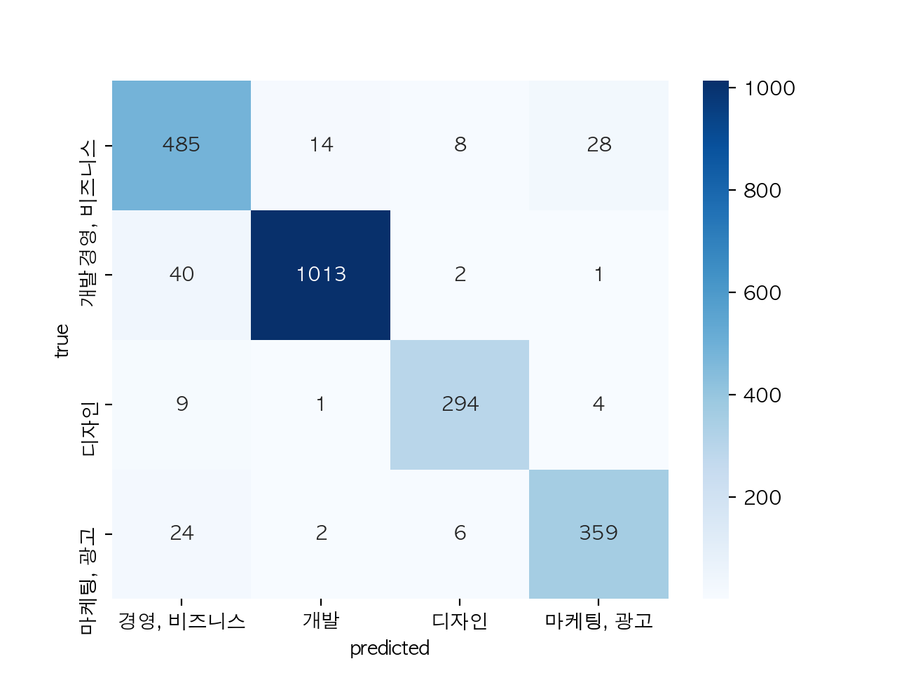

# 원티드랩 사전 과제

1. **JD 직무 분류 모델 구성**
2. **로그인, 직무 분류 API 서버 구현**

# **분류 모델 구성**

### **훈련 과정**

#### **데이터 전처리**

1. 직무 json파일을 pandas Dataframe으로 변환
2. Dataframe내 "position", "main_tasks", "requirements", "preferred_points" 컬럼 데이터를 concatenate하여 하나의 컬럼으로 통합
3. 통합된 컬럼의 데이터를 정제후 Konlpy의 Okt로 토큰화, 추후 추론을 위하여 토크나이저 저장
4. 토크나이저로 토큰을 정수 변환 후 모델 입력 크기에 맞게 스퀀스 패딩

#### **모델 훈련**

5. 패딩된 데이터를 모델에 입력 후 훈련
6. LSTM 유닛 수, 임베딩 크기, vocab_size를 적절히 바꿔가며 하이퍼 파라미터 튜닝

### **모델 정의**

- 본 과제에서는 text classification과제에 간단하고 좋은 성능을 보인 워드 임베딩 레이어를 포함한 LSTM을 사용
- 임베딩 레이어는 입력 단어의 vector representation을 배우고 lstm 레이어는 단어간 dependencies를 학습할 것이라 예상 (... 경영 개발 ... vs ... 파이썬 개발 ....)
  - _embedding 과 lstm사이에 BN, activation, max pooling을 더했더니 더 빠른 수렴과 좋은 결과가 나옴_
- 출력단에 dense 레이어와 softmax 함수를 사용하여 각 카테로리 별 logit 계산 후 backpropagate,

  

- loss function: cross entropy, optimizer: Adam optimizer
- 최고의 성능을 보인 모델 저장을 위하여 model checkpointing 및 빠른 학습 종료를 위한 early stopping 사용

### **성능 평가**

- multiclassification task로 accuracy, average precision등 지표를 사용하여 평가

    

> 소극적인 하이퍼파라미터 튜닝과 간단한 아키텍처에 비해 94%의 인상적인 정확도를 보임. 또한 전반적으로 모든 클래스에 대해서 높은 precision 및 recall 값을 보임

- confusion matrix로 예측값/실제값 시각화

    

# **API 서버 구현**

> 두 api 서버 모두 flask를 사용하여 개발

### **로그인 API**

- email과 password를 request body에서 가져와서 authenicate (본 과제에서는 로그인 로직 하드코딩)
- email과 password 일치 시 jwt 발행 후 response body에 추가하여 응답

### **분류 API**

- 서버 실행시 모델 및 전처리 도구 로드
- request에 포함된 auth key 토큰을 jwt decode하여 validty 확인
- valid한 토큰이 아니라면 에러 메시지 전송
- valid한 토큰이라면
  - jd_text를 전처리 도구를 사용하여 모델 입력에 맞게 전처리 (위 데이터 전처리 2. ~ 4. 과정)
  - 전처리 된 데이터를 모델 입력 후 모델 추론
  - 추론값을 response message "직군"에 담아 전송
